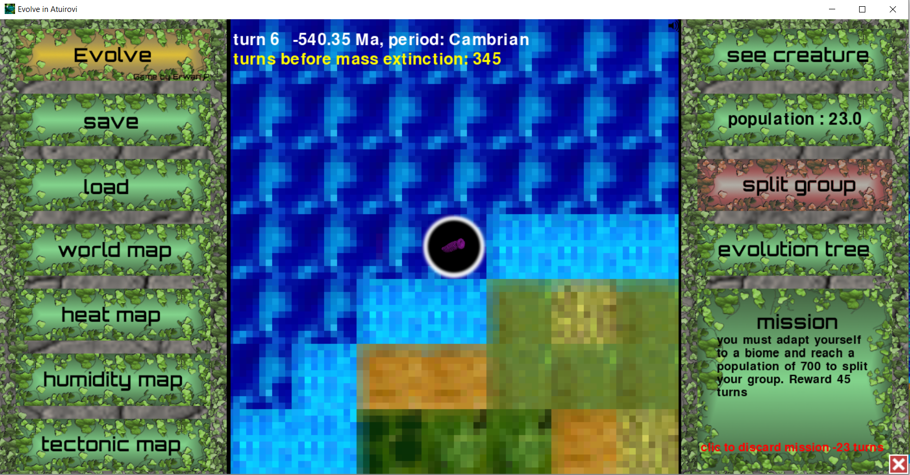
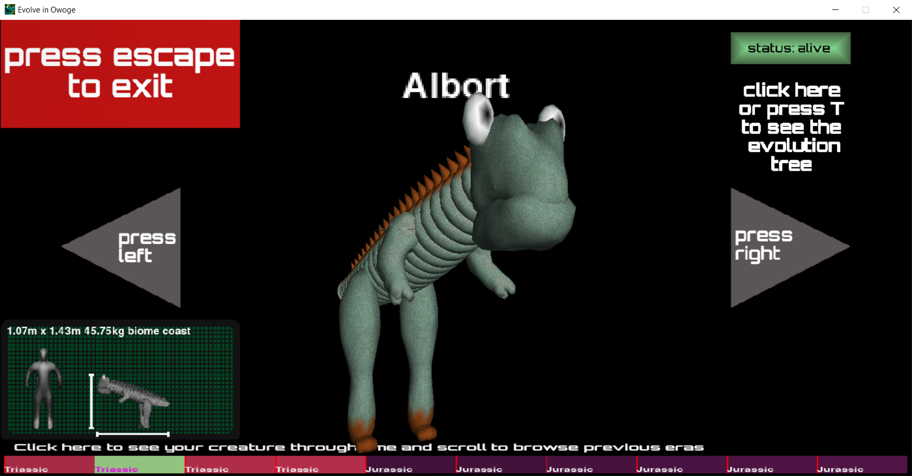
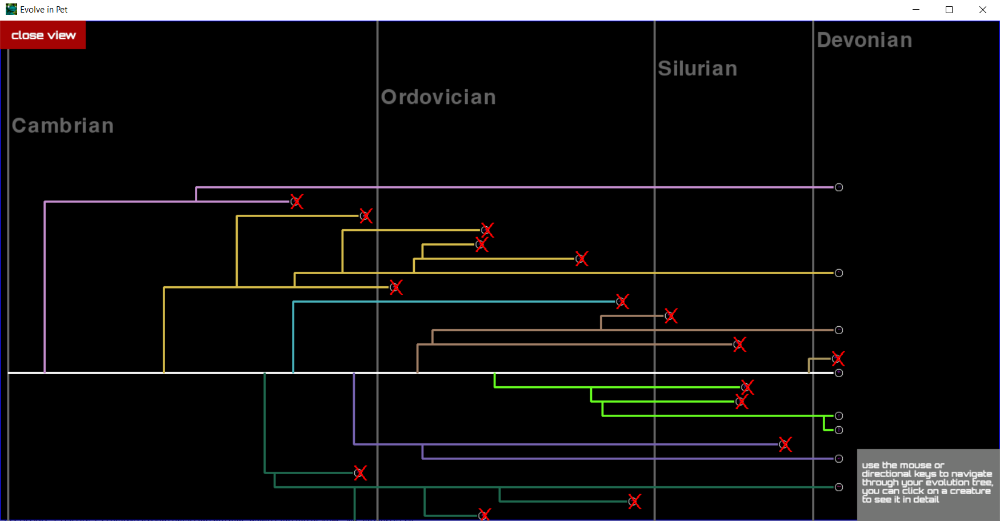
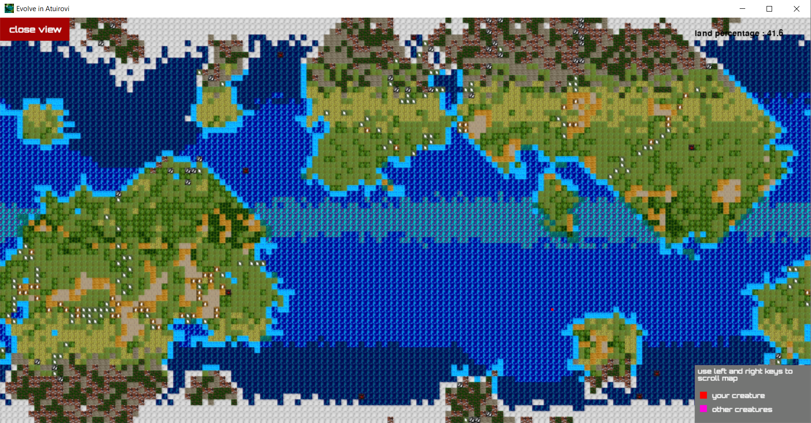

# Evolve

Evolve is a turn based game where the goal is to make your group of creatures survive and evolve, each turn is a step in the time where your group of creatures and its environment may change, you thus have to carefully guide your group to adapted biomes.

<p align="left">
  
</p>

You have to choose at each turn where you want to send your group of creature and try to keep a population high enough to breed. Evolution of your creatures is guided by where you send them.

<p align="left">
  
</p>

You can see your creature in details and how it has changed during its evolution in a dedicated tab. You will obtain a unique creature in each game with its own history! Moreover you can split your group of creatures leading to a speciation, sister species will roam your world and evolve on their own.

<p align="left">
  
</p>

These sister species will appear in your evolution tree and breed as well.

<p align="left">
  
</p>

The world in which you live is randomly generated in each game and is changing through time entering glaciations, heating periods, meteors, volcanoes, and continental moves. Your creature can also be affected by local climate change due to storms.
You can play in 3 difficulty modes with missions to comply or in free mode without. Try to reach present times and you will get your score according to the missions done and exploration of the world.

## Installation

Use the package manager [pip](https://pip.pypa.io/en/stable/) to install foobar.

```bash
pip install foobar
```

## Usage

```python
import foobar

# returns 'words'
foobar.pluralize('word')

# returns 'geese'
foobar.pluralize('goose')

# returns 'phenomenon'
foobar.singularize('phenomena')
```

## Contributing
Pull requests are welcome. For major changes, please open an issue first to discuss what you would like to change.

Please make sure to update tests as appropriate.

## License
[MIT](https://choosealicense.com/licenses/mit/)
